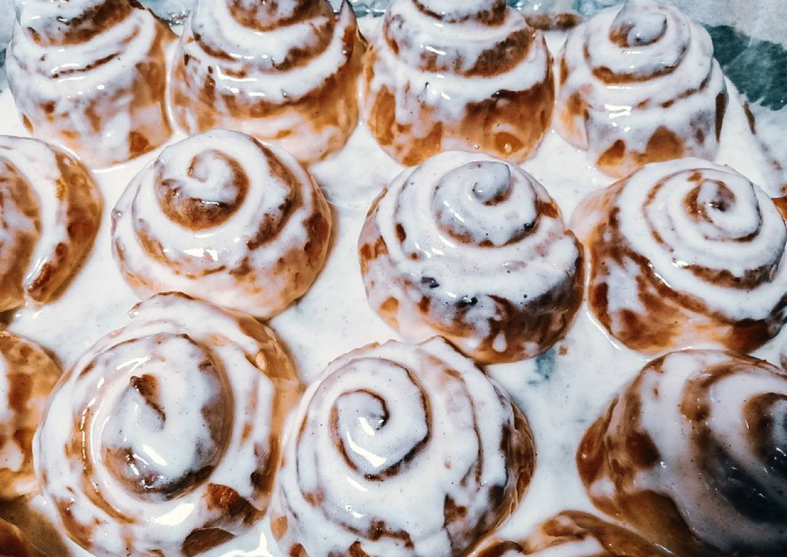

# Ресепт замечательных плюшек с корицей Синабон

## Ингридиенты:
1. мука - 600 гр.
2. молоко - 200 мл
3. яйцо - 2 шт
4. сахар - 0,5 стакана
5. соль - 0,5 ч.л
6. дрожжи - 11 гр
7. масло сливочное - 80 гр
## Начинка:
1. Сахар - 1 стакан
2. Масло - 50 гр
3. Корица - 20 гр
## Крем :
1. Сахарная пудра - 100 гр
2. масло сливочное - 1,5 ст. л
3. сыр сливочный - 200 гр
## Как готовить:
замешиваем тесто. ждем 2 часа. тем временем готовим начинку - все смешиваем. Раскатываем тесто, наносим равномерно начинку, сворачиваем рулетом. разрезаем, ставим в духовку. Тем временем все ингредиенты для глазури взбиваем. Готовые булочки достаем и намазываем кремом.
